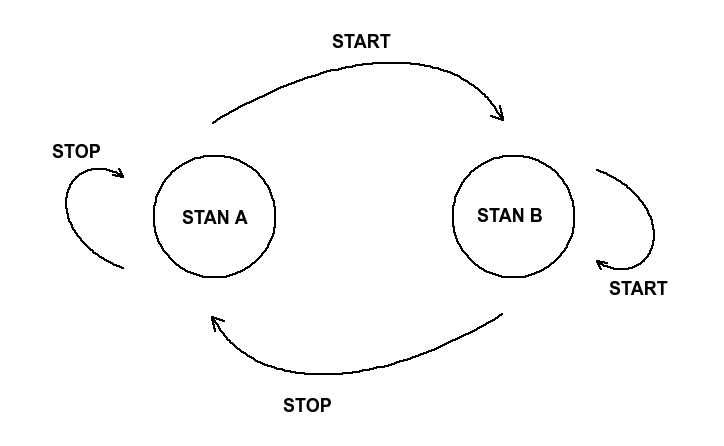

State design pattern i Python
===

1. Wstep
2. State Design Pattern
3. Case study
    - bez State'a
    - ze State'em
    - droga na skróty -> python-statemachine

Definicja
---

GOF:
```
Allows an object to alter its behaviours when its internal state changes. The object will appear to change its class.
```

Wzorzec z grupy tzw. czynnościowych (behavioral) skupiających się na opisywaniu
zachowań i odpowiedzialność współpraucujących ze sobą obiektów.

UML:


Przekładając to na praktykę:

Każdy ze stanów jest enkapsulowany za pomocą dedykowanej klasy, która implementuje
interfejs uwspólniony dla wszystkich stanów. Interfejse ten stanowi grupę metod,
które określają reguły przejść pomiędzy stanami.



```python
class StateI:
    # de facto w metodach jest zaimplementowana logika biznesowa

    def on_start(self):
        raise NotImplementedError()

    def on_stop(self):
        raise NotImplementedError()


class StateA(StateI):

    def on_start(self):
        return StateB()

    def on_stop(self):
        return self


class StateB(StateI):

    def on_start(self):
        return self

    def on_stop(self):
        return StateA()
```

Case study:
---

[Przyklad 1 - jak to wygląda zazwyczaj](state_example1.py)  
[Przyklad 2 - aplikujemy State'a!](state_example2.py)  
[Przyklad 3 - elegancki State za pomocą python-statemachine](state_example3.py)
