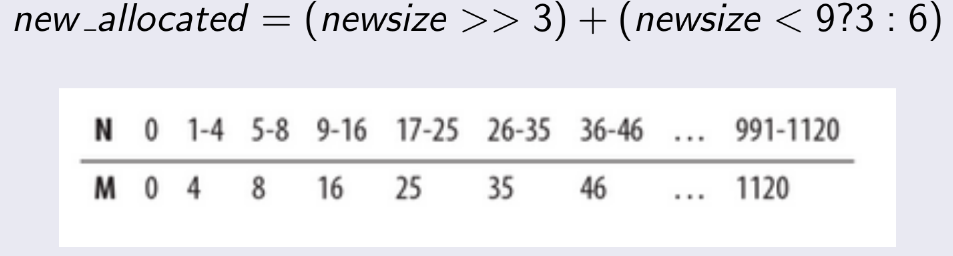

Python under the hood
=====================

Objects, names, binding
---

```python
>>> class Foo:
...    pass

>>> Foo()       # object creation
>>> bar = Foo() # object bound to name 'bar'
```

Id, hash
---

```python
>>> id(bar)
>>> hash(bar)       # hash = id(bar) * 16 in default implementation
```

Python's `is` operates on ids.  
Dicts operates on `hash`.  
Not every object has hash (aka `is hashable`), mutable objects (e.g. list) don't
have hashes, immutable - do.

Small integers caching
---
Small integers (-5, 256) are pre cached at interpreter as these numbers
are 'popular'.

```python
>>> x, y = 100, 100
>>> x is y
True
>>> x += 1
>>> y += 1
>>> x is y
True
>>> x, y = 500, 500
>>> x is y
True
# but if you define in separate lines
>>> x = 100
>>> y = 100
>>> x is y
True
>>> x = 500
>>> y = 500
>>> x is y
False
```


Ref count
---
```python
>>> import sys

>>> bar = Foo()
>>> sys.getrefcount(bar)
2       # always ref + 1 due to some internal reference
>>> another_name = bar
>>> sys.getrefcount(bar)
3
>>> sys.getrefcount(another_name)       # just another binding pointing to the same object
3
>>> another_name is bar
True
>>> del another_name
>>> sys.getrefcount(bar)
2
>>> sys.getrefcount(baranother_name)
NameError: name 'another_name' is not defined

>>> import copy
>>> another_name = copy.copy 
>>> sys.getrefcount(bar)
2
>>> sys.getrefcount(another_name)
2
>>> another_name is bar
False

>>> import ctypes   # foreign function interface
>>> address = id(bar)
>>> ctypes.c_long.from_address(address).value
1   # ref count without internal reference
>>> del bar
>>> ctypes.c_long.from_address(address).value
0   # but object exists somewhere, only refence was deleted

# Fun fact:
>>> ctypes.c_long.from_address(1405300919241).value     # some random address
Segmentation fault (core dumped)

# ctypes can be dangerous!
>>> a = [1, 2, 3, 4, 5]
>>> id(a)
140215104178008
>>> a = [x for x in a if x > 3]
>>> a
[4, 5]
>>> id(a)
140215104179232

# precached values:
>>> a = 1
>>> ctypes.c_long.from_address(address).value
627
>>> del a
>>> ctypes.c_long.from_address(address).value
626     # should be the same each time we launch fresh interpreter
>>> sys.getrefcount(None)       # None is just an object!
2522
>>> a = None
>>> sys.getrefcount(None)
>>> 2523
# now you may know why we compare to None using `is` operator
```

String interning
---

String interning is a technique for effective string objects reusing.
Instead of creating gazillion of new strings objects, Python caches strings and re-uses them if needed.
String interning is not always performed:

```python
>>> import ctypes
>>> "hell" + "o" is "hello"
True                                                # automatic string interning
>>> s1 = 'hell'
>>> s2 = 'hello'
>>> s1 + 'o' is s2
False                                               # not interning strings
>>> s1 + 'o' == s2
True
>>> s3 = 'hello'
>>> ctypes.c_long.from_address(id(s3)).value
2                                                   # string interning
>>> s4 = 'hello from the other side'
>>> s5 = 'hello from the other side'
>>> ctypes.c_long.from_address(id(s5)).value        
1                                                   # doesn't work for longs strings :(
>>> s6 = '{}o'.format(s1)
>>> s6
>>> ctypes.c_long.from_address(id(s6)).value        # worked!
2
>>> ctypes.c_long.from_address(id(s1)).value
1                                                   # but s1 is not re-used i.e. s6 is completely new object, not an object reffering to s1 and 'o' letter
```

To learn more, read about [Flyweight](https://www.youtube.com/watch?v=2C71YTKklT8) design pattern.

Garbage Collection
---
```python
>>> bar = Foo()
>>> gc.get_referents(bar)
[<class __main__.Foo at 0x7f072b00fae0>, {}]        # class definition
>>> gc.is_tracked(bar)
True
>>> address = id(bar)
>>> ctypes.cast(address, ctypes.py_object).value
<__main__.Foo instance at 0x7f072afc5950>       # class instance
>>> del bar
>>> ctypes.cast(address, ctypes.py_object).value
<__main__.Foo instance at 0x7f072afc5950>   # still exists!
>>> gc.collect()
0
>>> ctypes.cast(address, ctypes.py_object).value    # we could even retreive this object
(<refcnt 0 at 0x7f072b009560>, 'cast')
>>> ctypes.cast(address, ctypes.py_object).value
(<refcnt 0 at 0x7f072b009518>, 'py_object')
>>> ctypes.cast(address, ctypes.py_object).value
Fatal Python error: GC object already tracked
Aborted (core dumped)
```

Python's GC key words:  
- reference counting
- reference cycle detection
- garbage collection generations (3 in case of Python)
- mark and sweep algorithm
- weak reference

You may also want to compare Python's GC solution to Ruby's,
which uses techniques called `free list` and `stop the world algorithm`.

PyObject
---

```c
/* Nothing is actually declared to be a PyObject, but every pointer to
 * a Python object can be cast to a PyObject*.  This is inheritance built
 * by hand.  Similarly every pointer to a variable-size Python object can,
 * in addition, be cast to PyVarObject*.
 */
typedef struct _object {
    _PyObject_HEAD_EXTRA
    Py_ssize_t ob_refcnt;
    PyTypeObject *ob_type;
} PyObject;

```
PyObject acts as a interface.


source:  
https://github.com/python/cpython/blob/master/Include/object.h  
Brief description of Python internal structures:  
https://docs.python.org/3.8/c-api/structures.html

Lists, Dicts, Tuples
---

### List

```python
>>> import sys
>>> my_list = []
>>> sys.getsizeof(my_list)      # Returns size of an object in bytes(1)
72
>>> my_list.append(1)
>>> sys.getsizeof(my_list)
104
>>> my_list.append(1)
>>> sys.getsizeof(my_list)
104
>>> my_list.append(1)
>>> sys.getsizeof(my_list)
104
>>> my_list.append(1)
>>> sys.getsizeof(my_list)
104
>>> my_list.append(1)
>>> sys.getsizeof(my_list)
136
>>> my_list
[1, 1, 1, 1, 1]
>>> my_list.pop()
1
>>> sys.getsizeof(my_list)
136
>>> my_list.pop()
1
>>> sys.getsizeof(my_list)
120

# List pre-allocates some memory to perform fast appends
# Every element occupies 8B of memory - this is size of PyObject pointer
# (1) Works fine for built-ins, doesn't have to for 3rd party
```

List allocation equation:  


Explicitly declared list has no over allocation, however, adding any
new element will cause over-allocation:  
```python
>>> my_list = [1, 2, 3]
>>> sys.getsizeof(my_list)
96
>>> my_list.append(4)
>>> sys.getsizeof(my_list)
128
```

source:  
https://github.com/python/cpython/blob/master/Include/listobject.h  
https://github.com/python/cpython/blob/master/Objects/listobject.c#L24

### Dict

```python
>>> import sys
>>> my_dict = {}
>>> sys.getsizeof(my_dict)
280
>>> my_dict['key1'] = 1
>>> sys.getsizeof(my_dict)
280
>>> my_dict['key2'] = 2
>>> sys.getsizeof(my_dict)
280
>>> my_dict['key3'] = 3
>>> sys.getsizeof(my_dict)
280
>>> my_dict['key4'] = 4
>>> sys.getsizeof(my_dict)
280
>>> my_dict['key5'] = 5
>>> sys.getsizeof(my_dict)
280
>>> my_dict['key6'] = 6
>>> sys.getsizeof(my_dict)
1048
```

Dict pre-allocates 8 chunks of memory and grows x4 when is 2/3 full.
If there are more than 50k allocated chunks of memory, then it grows 2x with
every re-allocation. Number of allocated chunks of memory will be as followed:    
8, 32, 128, 514, 2048, 8192, 32768, 131072, 262133...

How dict works:  

- Calculate object's hash e.g. 12345
- Calculate index = hash AND mask
- mask = allocated elements - 1
- 0b001 = 0b11000000111001 AND 0b111        # for mask = 7
- index = 1
- If index == 1 is empty -> put pair of key and value there
- If index == 1 is not empty -> new index = index + 1 (check if empty again)

```
Dict's index calculation is not really focused on avoiding collisions.
It's focused on fast computation since everytime we re-size dict we
need to re-calculate all indexes (mask changes).
```

### Tuple
Tuples are simple and there's no magic here, since tuple has fixed size
there is no magical pre-allocation:

```python
>>> import sys
>>> my_tuple = (1,)
>>> sys.getsizeof(my_tuple)
64
>>> my_tuple = (1, 2)
>>> sys.getsizeof(my_tuple)
72
>>> my_tuple = (1, 2, 3)
>>> sys.getsizeof(my_tuple)
80
```


inspect module
---
This module can help us get information about object's properties at runtime.


### frames
Python's interpreter works as a stack machine. Code at runtime is represented
by frames which are operating over virtual stack. At the same time,
frames are just regular objects! If so, we can access them.

```python
>>> import inspect
>>> def hello():
...     current_frame = inspect.currentframe()
...     print(inspect.getframeinfo(current_frame))
...     print(current_frame.f_globals)
...     print(current_frame.f_locals)
...     print(current_frame.f_code)
...     print(current_frame.f_back)     # previous frame, the caller
... 
>>> hello()
Traceback(filename='<stdin>', lineno=3, function='hello', code_context=None, index=None)
{'a': <function hello at 0x7f0889373938>, '__builtins__': <module '__builtin__' (built-in)>, 'inspect': <module 'inspect' from '/usr/lib/python2.7/inspect.pyc'>, '__doc__': None, 'ctypes': <module 'ctypes' from '/usr/lib/python2.7/ctypes/__init__.pyc'>, 'address': 139674638563640, '__name__': '__main__', '__package__': None, 'hello': <function hello at 0x7f08893738c0>}
{'current_frame': <frame object at 0x7f088adadc58>}
<code object hello at 0x7f0889388730, file "<stdin>", line 1>
<frame object at 0x7f0889384be8>
>>> address = 0x7f0889384be8
>>> func = ctypes.cast(address, ctypes.py_object).value     # we can access this frame by id!
>>> func
<frame object at 0x7f0889384be8>
```
As crazy as it sounds but we can access data from previous frames. It can be
used e.g for some logging purposes or debug stuff.  

...in fact it's not that crazy, since stack trace is just an example of
a useful information obtained from runtime frames.


dis module
---
Module module allows to analise CPython bytecode. Bytecode is an actual
code which interpreter evaluates:  
```python
>>> import dis
>>> dis.dis(foo)
>>> dis.dis(foo)
  2           0 LOAD_FAST                0 (arg)
              3 RETURN_VALUE        
```

Each instruction (LOAD_FAST, RETURN_VALUE) has an opcode. Definitions
of all opcodes are stored here:  
https://github.com/python/cpython/blob/master/Include/opcode.h

Python's main loop iterates over bytecode and execute specific functions
based on opcode id. You can check Python's main loop implementation here:  
https://github.com/python/cpython/blob/master/Python/ceval.c#L1490

weakref
---
TODO 

### Resources

[Python source code](https://github.com/python/cpython)  
[Memory Management](https://rushter.com/blog/python-memory-managment/)  
[Python objects sizes](https://stackoverflow.com/questions/449560/how-do-i-determine-the-size-of-an-object-in-python)  
[10 hrs CPython interpreter tutorial](https://pg.ucsd.edu/cpython-internals.htm)  
[Frames visualisation](http://www.pythontutor.com/)  
[CPython Internals - Book](https://realpython.com/products/cpython-internals-book/)  
[Python interpreter consts definitions](https://github.com/python/cpython/blob/master/Include/pyport.h)  
[GC explained](https://rushter.com/blog/python-garbage-collector/)
